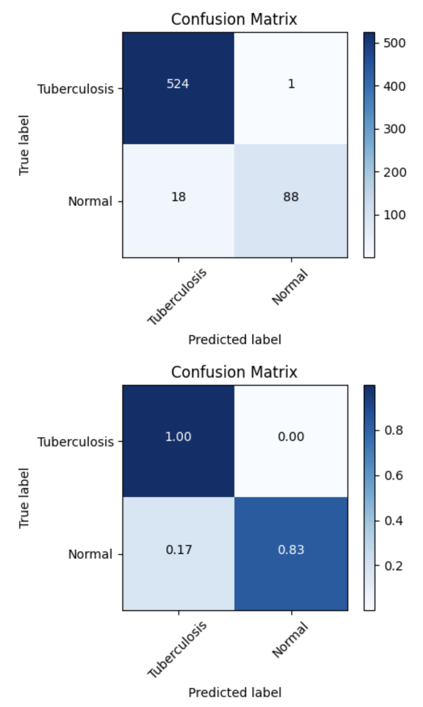
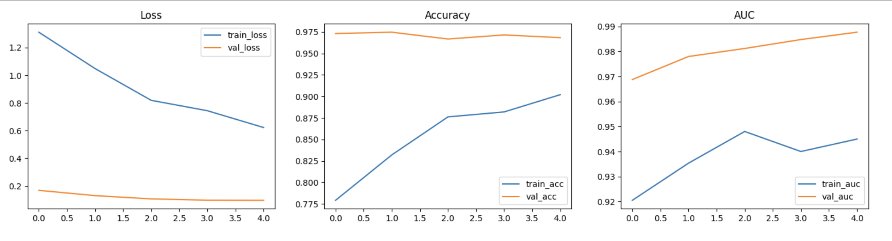
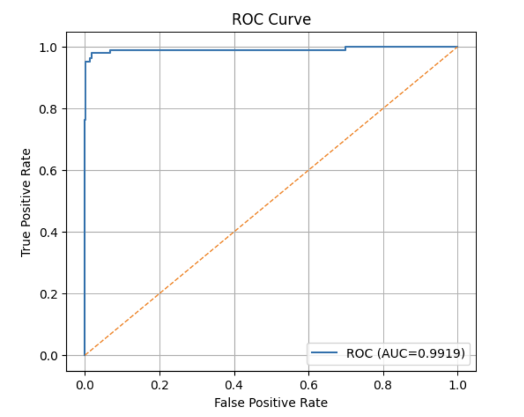

# 🩺 Tuberculosis Detection from Chest X-Rays

AI-powered tuberculosis detection from chest X-rays using DenseNet121, 
achieving ~97% accuracy and high AUC performance.

This project demonstrates how deep learning can assist in early diagnosis 
of tuberculosis through medical imaging, helping improve accessibility to 
screening in resource-limited settings.

---

## 📌 Overview

Tuberculosis remains one of the leading infectious diseases worldwide. Early 
detection is critical for effective treatment. This project builds an AI-powered 
classification model that analyzes chest X-ray images and determines whether a 
patient shows signs of TB or not.

---

## 🎯 Objectives

- Develop an accurate TB detection model using medical imaging
- Handle real-world challenges like class imbalance
- Build a reproducible and well-documented ML pipeline
- Evaluate model performance using clinical metrics (AUC, F1, Precision, Recall)

---

## ⭐ Key Features

- End-to-end deep learning pipeline
- Transfer learning using DenseNet121
- Handles class imbalance with weighted loss
- Strong evaluation using AUC, F1-score, and confusion matrix
- Reproducible and well-structured workflow

---

## 📊 Dataset

- **Source:** TB Chest Radiography Dataset (Kaggle)
- **Download:** https://www.kaggle.com/datasets/tawsifurrahman/tuberculosis-tb-chest-xray-dataset
- **Classes:**
  - Tuberculosis: 700 images
  - Normal: 3,500 images
- **Total:** 4,200 images
- **Split:** 70% train / 15% validation / 15% test

> ⚠️ Dataset is not included in this repository. Download from Kaggle and 
> place in the `data/` folder.

---

## ⚙️ Tech Stack

- Python
- TensorFlow / Keras
- DenseNet121 (pretrained on ImageNet)
- OpenCV
- NumPy & Matplotlib
- Scikit-learn
- Google Colab

---

## 🧪 Methodology

### 1. Exploratory Data Analysis
- Class distribution analysis
- Sample image visualization
- Pixel intensity statistics
- Corruption checks

### 2. Image Preprocessing & Augmentation
- Resized all images to 224×224
- Applied augmentation: rotation, zoom, horizontal flip
- DenseNet121 preprocessing applied

### 3. Handling Class Imbalance
- Applied class weights to prevent bias toward the majority class

### 4. Model Architecture
- **Base:** DenseNet121 pretrained on ImageNet (frozen)
- **Custom head:**
  - Global Average Pooling
  - Batch Normalization
  - Dropout (0.4)
  - Dense layer (128 units, ReLU)
  - Dropout (0.3)
  - Output layer (Sigmoid)
- **Total params:** 7,173,441
- **Trainable params:** 133,633

### 5. Training
- Optimizer: Adam (lr=1e-4)
- Loss: Binary Crossentropy
- Metrics: Accuracy, AUC
- Callbacks: ModelCheckpoint, EarlyStopping, ReduceLROnPlateau

---

## 📈 Results

| Metric | Score |
|--------|-------|
| Accuracy | 97% |
| AUC | 0.9919 |
| Precision | 98.88% |
| Recall | 83.02% |
| F1 Score | 0.9026 |

> ✅ Tested on 631 chest X-ray images

---

## 📊 Model Performance

### Confusion Matrix


### Training Curves


### ROC Curve

---

## 🚀 How to Run

1. **Clone the repository**
```bash
git clone https://github.com/nalamnyone/tb-xray-detection.git
cd tb-xray-detection
```

2. **Install dependencies**
```bash
pip install tensorflow==2.19.0 numpy matplotlib opencv-python scikit-learn tqdm Pillow
```

3. **Download dataset**
Download from Kaggle and place in:

data/TB_Chest_Radiography_Database/Tuberculosis/
data/TB_Chest_Radiography_Database/Normal/

5. **Run the notebook**
Open tuberculosis_detection.ipynb in Jupyter or Google Colab

---

##  Future Improvements

- Fine-tuning the DenseNet121 base model
- Grad-CAM visualization for model interpretability
- Deploy as a Streamlit web application
- Expand to multi-disease classification
